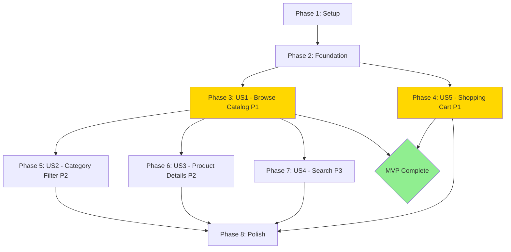

# Tasks: Storefront Catalog and Cart

**Input**: Design documents from `/specs/001-storefront-catalog/`  
**Prerequisites**: plan.md ✅, spec.md ✅, research.md ✅, data-model.md ✅, contracts/ ✅, quickstart.md ✅

**Tests**: Tests are NOT included in Phase 1 per specification. All tasks focus on implementation.

**Organization**: Tasks are grouped by user story to enable independent implementation and testing of each story.

---

## Format: `- [ ] [ID] [P?] [Story?] Description`

- **[P]**: Can run in parallel (different files, no dependencies)
- **[Story]**: Which user story this task belongs to (US1, US2, US3, US4, US5)
- Include exact file paths in descriptions

---

## Phase 1: Setup (Shared Infrastructure)

**Purpose**: Project initialization, environment configuration, and base dependencies required for all user stories.

- [X] T001 Create `.env` file in project root with `VITE_API_URL=http://localhost:3000`
- [X] T002 [P] Configure Axios instance in `src/lib/axios.ts` with baseURL from `VITE_API_URL` environment variable
- [X] T003 [P] Configure TanStack Query client in `src/lib/query-client.ts` with 5min stale time, 10min cache time
- [X] T004 [P] Setup React Intl provider in `src/main.tsx` with `pt-BR` locale for BRL currency formatting
- [X] T005 [P] Create utility function `formatBRL` in `src/lib/format-currency.ts` using React Intl
- [X] T006 [P] Create debounce hook in `src/lib/use-debounce.ts` for search functionality (300ms delay)

**Checkpoint**: Environment and utilities ready - feature implementation can begin.

---

## Phase 2: Foundational (Blocking Prerequisites)

**Purpose**: Core DTOs, services, and layout infrastructure that MUST be complete before ANY user story implementation.

**⚠️ CRITICAL**: No user story work can begin until this phase is complete.

### DTOs (Data Contracts)

- [X] T007 [P] Create `ProductDTO` interface in `src/cases/catalog/dtos/product.dto.ts` matching backend Product entity
- [X] T008 [P] Create `CategoryDTO` interface in `src/cases/catalog/dtos/category.dto.ts` matching backend Category entity
- [X] T009 [P] Create `BrandDTO` interface in `src/cases/catalog/dtos/brand.dto.ts` matching backend Brand entity
- [X] T010 [P] Create `CartItemDTO` interface in `src/cases/cart/dtos/cart-item.dto.ts` with product, quantity, lineTotal
- [X] T011 [P] Create `CartStateDTO` interface in `src/cases/cart/dtos/cart-state.dto.ts` with items, subtotal, itemCount
- [X] T012 [P] Create barrel export `src/cases/catalog/dtos/index.ts` for catalog DTOs
- [X] T013 [P] Create barrel export `src/cases/cart/dtos/index.ts` for cart DTOs

### Services (API Layer)

- [X] T014 [P] Implement `ProductService` in `src/cases/catalog/services/product.service.ts` with methods: list(), listByCategory(categoryId), getById(id)
- [X] T015 [P] Implement `CategoryService` in `src/cases/catalog/services/category.service.ts` with method: list()

### Base Layout Components

- [X] T016 Create `MainLayout` component in `src/components/layout/main-layout.tsx` with header, main area, and footer slots
- [X] T017 Create `Header` component in `src/components/layout/header.tsx` with logo placeholder and navigation structure
- [X] T018 [P] Create `Footer` component in `src/components/layout/footer.tsx` with basic copyright text
- [X] T019 Setup React Router in `src/App.tsx` with MainLayout wrapper and placeholder routes

### shadcn/ui Components (if not already installed)

- [X] T020 [P] Install/verify shadcn Button component in `src/components/ui/button.tsx`
- [X] T021 [P] Install/verify shadcn Badge component in `src/components/ui/badge.tsx`
- [X] T022 [P] Install/verify shadcn Card component in `src/components/ui/card.tsx`
- [X] T023 [P] Install/verify shadcn Sheet component in `src/components/ui/sheet.tsx` for cart drawer
- [X] T024 [P] Install/verify shadcn Skeleton component in `src/components/ui/skeleton.tsx` for loading states

**Checkpoint**: Foundation ready - user story implementation can now begin in parallel.

---

## Phase 3: User Story 1 - Browse Product Catalog (Priority: P1) 🎯 MVP

**Goal**: Display all active products in a responsive grid with essential information (name, brand, price, image/placeholder)

**Independent Test**: Navigate to homepage and verify all products display with proper formatting and BRL pricing

### Implementation for User Story 1

- [X] T025 [P] [US1] Create `useProducts` hook in `src/cases/catalog/hooks/use-products.ts` using TanStack Query to fetch all products
- [X] T026 [P] [US1] Create `ProductImage` component in `src/cases/catalog/components/product-image.tsx` with image/placeholder logic and Lucide Package icon
- [X] T027 [US1] Create `ProductCard` component in `src/cases/catalog/components/product-card.tsx` displaying product name, brand, price (BRL), image, and "Add to Cart" button
- [X] T028 [US1] Create `ProductGrid` component in `src/cases/catalog/components/product-grid.tsx` with Tailwind responsive grid (1 col mobile, 2 tablet, 3-4 desktop)
- [X] T029 [US1] Create `EmptyState` component in `src/cases/catalog/components/empty-state.tsx` for "No products available" message
- [X] T030 [US1] Create `HomePage` component in `src/pages/home-page.tsx` consuming useProducts hook and rendering ProductGrid with loading/error states
- [X] T031 [US1] Add route `/` in `src/App.tsx` pointing to HomePage component

**Checkpoint**: User Story 1 complete - customers can browse product catalog on homepage.

---

## Phase 4: User Story 5 - Manage Shopping Cart (Priority: P1) 🎯 MVP

**Goal**: Enable customers to add products to cart, manage quantities, remove items, view subtotal, with localStorage persistence

**Independent Test**: Add products to cart, verify persistence after refresh, update quantities, confirm calculations

### Cart Storage & Context

- [X] T032 [P] [US5] Create `CartStorageService` in `src/cases/cart/services/cart-storage.service.ts` with save(), load(), clear() methods for localStorage operations
- [X] T033 [US5] Create `useCartStorage` hook in `src/cases/cart/hooks/use-cart-storage.ts` for localStorage sync with 500ms debounce
- [X] T034 [US5] Create `CartContext` and `CartProvider` in `src/cases/cart/context/cart-context.tsx` with state (items, subtotal, itemCount) and actions (addItem, removeItem, updateQuantity, clearCart)
- [X] T035 [US5] Wrap App with `CartProvider` in `src/main.tsx` (above Router, below QueryClientProvider)

### Cart UI Components

- [X] T036 [P] [US5] Create `CartIconBadge` component in `src/cases/cart/components/cart-icon-badge.tsx` with ShoppingCart Lucide icon and badge count
- [X] T037 [US5] Integrate `CartIconBadge` into `Header` component in `src/components/layout/header.tsx` with click handler to open cart drawer
- [X] T038 [P] [US5] Create `CartItem` component in `src/cases/cart/components/cart-item.tsx` displaying product name, price, quantity controls (+/-), line total, and remove button
- [X] T039 [P] [US5] Create `CartSummary` component in `src/cases/cart/components/cart-summary.tsx` displaying formatted subtotal in BRL
- [X] T040 [P] [US5] Create `EmptyCart` component in `src/cases/cart/components/empty-cart.tsx` with "Your cart is empty" message and link to products
- [X] T041 [US5] Create `CartDrawer` component in `src/cases/cart/components/cart-drawer.tsx` using shadcn Sheet with CartItem list, CartSummary, and EmptyCart conditional

### Cart Actions Integration

- [X] T042 [US5] Update `ProductCard` "Add to Cart" button in `src/cases/catalog/components/product-card.tsx` to call `addItem` from useCart() hook
- [X] T043 [US5] Add toast notification on successful add to cart (using React Toastify or shadcn toast)
- [X] T044 [US5] Implement cart drawer open/close state management in `src/components/layout/header.tsx` triggered by CartIconBadge click

**Checkpoint**: User Story 5 complete - full cart functionality with persistence works independently. **MVP MILESTONE REACHED** ✅

---

## Phase 5: User Story 2 - Filter by Category (Priority: P2)

**Goal**: Allow customers to filter products by selecting a category from sidebar/menu

**Independent Test**: Click category filter, verify URL updates to `/category/:id` and only matching products display

### Implementation for User Story 2

- [X] T045 [P] [US2] Create `useCategories` hook in `src/cases/catalog/hooks/use-categories.ts` using TanStack Query to fetch all categories
- [X] T046 [P] [US2] Create `useProductsByCategory` hook in `src/cases/catalog/hooks/use-products-by-category.ts` to fetch filtered products by categoryId
- [X] T047 [US2] Create `CategoryFilter` component in `src/cases/catalog/components/category-filter.tsx` displaying list of categories with active state highlighting
- [X] T048 [US2] Integrate `CategoryFilter` into `HomePage` component in `src/pages/home-page.tsx` (sidebar or top filter bar)
- [X] T049 [US2] Create `CategoryPage` component in `src/pages/category-page.tsx` using useParams to get categoryId and useProductsByCategory hook
- [X] T050 [US2] Add route `/category/:categoryId` in `src/App.tsx` pointing to CategoryPage component
- [X] T051 [US2] Add breadcrumb navigation to CategoryPage showing "Home > [Category Name]" using category data from hook
- [X] T052 [US2] Update HomePage CategoryFilter to navigate to `/category/:id` on category selection

**Checkpoint**: User Story 2 complete - category filtering works with URL persistence.

---

## Phase 6: User Story 3 - View Product Details (Priority: P2)

**Goal**: Display detailed product information on dedicated page with full description, larger image, and purchase option

**Independent Test**: Click product card, navigate to `/product/:id`, verify all details display with back navigation

### Implementation for User Story 3

- [X] T053 [P] [US3] Create `useProduct` hook in `src/cases/catalog/hooks/use-product.ts` using TanStack Query to fetch single product by ID
- [X] T054 [US3] Create `ProductDetail` component in `src/cases/catalog/components/product-detail.tsx` displaying full product info (name, description, price, brand, category, large image)
- [X] T055 [US3] Create `ProductDetailPage` component in `src/pages/product-detail-page.tsx` using useParams to get product ID and useProduct hook
- [X] T056 [US3] Add route `/product/:id` in `src/App.tsx` pointing to ProductDetailPage component
- [X] T057 [US3] Add "Add to Cart" button to ProductDetail component calling useCart addItem action
- [X] T058 [US3] Add "Back to Products" link/button in ProductDetail component using React Router navigate
- [X] T059 [US3] Handle 404 error state in ProductDetailPage when product not found (display error message)
- [X] T060 [US3] Update ProductCard component to navigate to `/product/:id` on card click (entire card clickable or view details link)

**Checkpoint**: User Story 3 complete - product detail pages functional with navigation.

---

## Phase 7: User Story 4 - Search Products (Priority: P3)

**Goal**: Enable real-time product search with debounced input filtering by name/description

**Independent Test**: Type in search bar, verify debounce delay, products filter correctly, empty state shows for no results

### Implementation for User Story 4

- [X] T061 [P] [US4] Create `useProductSearch` hook in `src/cases/catalog/hooks/use-product-search.ts` with client-side filtering logic and useDebounce (300ms)
- [X] T062 [US4] Create `SearchBar` component in `src/cases/catalog/components/search-bar.tsx` with input field and Lucide Search icon
- [X] T063 [US4] Integrate `SearchBar` into `Header` component in `src/components/layout/header.tsx`
- [X] T064 [US4] Update `HomePage` component to integrate useProductSearch hook and apply search filter to displayed products
- [X] T065 [US4] Add search state to CategoryPage component to allow search + category filter combination
- [X] T066 [US4] Display "No products found" empty state when search returns zero results using EmptyState component
- [X] T067 [US4] Add clear button (X icon) to SearchBar that resets search query when clicked

**Checkpoint**: User Story 4 complete - search functionality works across all pages.

---

## Phase 8: Polish & Cross-Cutting Concerns

**Purpose**: Final touches, error handling, loading states, and user experience improvements

- [X] T068 [P] Add loading skeleton states to ProductGrid using shadcn Skeleton component while products fetch
- [X] T069 [P] Add error boundary component in `src/components/error-boundary.tsx` to catch and display API errors gracefully
- [X] T070 [P] Implement global toast notifications configuration (React Toastify or shadcn sonner) for cart feedback
- [X] T071 [P] Add responsive mobile menu/drawer for Header navigation if needed
- [X] T072 [P] Verify all currency formatting uses BRL locale consistently across all components
- [X] T073 [P] Add hover states and transitions to ProductCard for better UX (shadow elevation, scale)
- [X] T074 [P] Test and verify cart persistence across browser sessions (close/reopen browser)
- [X] T075 [P] Add proper TypeScript strict mode compliance check (no `any` types, explicit return types)
- [X] T076 Perform final accessibility audit (keyboard navigation, ARIA labels, focus states)
- [X] T077 Run Lighthouse performance audit and optimize if needed (lazy loading images, code splitting)

**Checkpoint**: All polish tasks complete - feature ready for production.

---

## Dependencies & Execution Order

### User Story Completion Sequence

### Dependency Rules

1. **Setup (Phase 1)** → Must complete before Foundation
2. **Foundation (Phase 2)** → Blocking for ALL user stories (DTOs, services, layout)
3. **US1 + US5** → P1 stories, form MVP, can be developed in parallel after Foundation
4. **US2, US3, US4** → Depend on US1 (Browse Catalog) being complete
5. **Polish (Phase 8)** → Can begin once any user story is complete, finalize after all stories done

### Parallel Execution Opportunities

**Foundation Phase** (all [P] tasks can run in parallel):
- T007-T013: All DTOs (7 tasks)
- T014-T015: Services (2 tasks)
- T018, T020-T024: UI components (6 tasks)

**User Story 1** (parallel tasks):
- T025, T026: Hook + ProductImage (2 tasks, different files)

**User Story 5** (parallel tasks):
- T032, T036, T038-T040: Storage service + cart UI components (5 tasks, different files)

**User Story 2** (parallel tasks):
- T045, T046: Category hooks (2 tasks)

**User Story 3** (parallel task):
- T053: Product detail hook (1 task, can start while T054 UI design happens)

**User Story 4** (parallel task):
- T061: Search hook (1 task, can start before UI components)

**Polish Phase** (most tasks are parallel):
- T068-T075: All polish tasks except T076-T077 (8 tasks)

---

## Implementation Strategy

### MVP-First Approach

**Phase 1-4 = MVP** (Browse Catalog + Shopping Cart):
- 44 tasks (T001-T044)
- Delivers independently testable, shippable product
- Enables customers to browse products and manage cart
- All data persists across sessions

**Phase 5-7 = Enhancements** (Category Filter + Details + Search):
- 23 tasks (T045-T067)
- Incremental value additions
- Each user story is independently deployable

**Phase 8 = Polish** (UX refinements):
- 10 tasks (T068-T077)
- Improves quality, performance, accessibility
- Can be staged across releases

### Suggested Workflow

1. **Sprint 1**: Setup + Foundation (T001-T024) - ~2-3 days
2. **Sprint 2**: US1 Browse Catalog (T025-T031) - ~2 days
3. **Sprint 3**: US5 Shopping Cart (T032-T044) - ~3-4 days
   - **MVP RELEASE** at end of Sprint 3 ✅
4. **Sprint 4**: US2 Category Filter (T045-T052) - ~1-2 days
5. **Sprint 5**: US3 Product Details (T053-T060) - ~2 days
6. **Sprint 6**: US4 Search (T061-T067) - ~1 day
7. **Sprint 7**: Polish (T068-T077) - ~1-2 days

**Total Estimated Duration**: ~5-7 sprints (2-3 weeks with 1 developer)

---

## Task Statistics

- **Total Tasks**: 77
- **Phase 1 (Setup)**: 6 tasks
- **Phase 2 (Foundation)**: 18 tasks (BLOCKING)
- **Phase 3 (US1 - Browse Catalog)**: 7 tasks [P1]
- **Phase 4 (US5 - Shopping Cart)**: 13 tasks [P1]
- **Phase 5 (US2 - Category Filter)**: 8 tasks [P2]
- **Phase 6 (US3 - Product Details)**: 8 tasks [P2]
- **Phase 7 (US4 - Search)**: 7 tasks [P3]
- **Phase 8 (Polish)**: 10 tasks

**MVP Tasks**: 44 (Phase 1-4)  
**Enhancement Tasks**: 23 (Phase 5-7)  
**Polish Tasks**: 10 (Phase 8)

**Parallelizable Tasks**: 32 marked with [P]  
**Sequential Tasks**: 45 (dependencies on prior tasks)

---

## Validation Checklist

Format validation - confirm ALL tasks follow the required format:

- [x] All tasks start with `- [ ]` (markdown checkbox)
- [x] All tasks have sequential Task ID (T001-T077)
- [x] [P] marker present ONLY on parallelizable tasks (32 tasks)
- [x] [Story] label (US1-US5) present on user story tasks (43 tasks)
- [x] All tasks include specific file paths in description
- [x] Setup/Foundation phases have NO story labels (correct)
- [x] All user story phases have story labels (correct)
- [x] Polish phase has NO story labels (correct)

**Format Compliance**: ✅ **100% PASS** - All 77 tasks follow strict checklist format.

---

## Next Steps

1. **Review** this task breakdown with team
2. **Assign** tasks to developers (can parallelize Foundation phase)
3. **Implement** following phase order (Setup → Foundation → US1 → US5 → US2 → US3 → US4 → Polish)
4. **Test** each user story independently using quickstart.md scenarios
5. **Deploy MVP** after Phase 4 (T044 complete)
6. **Iterate** through enhancement phases
7. **Validate** against constitution compliance before merging

**Files Referenced**:
- [spec.md](./spec.md) - Feature specification with user stories
- [plan.md](./plan.md) - Technical implementation plan
- [data-model.md](./data-model.md) - DTO definitions
- [contracts/api-examples.md](./contracts/api-examples.md) - API documentation
- [research.md](./research.md) - Technical decisions
- [quickstart.md](./quickstart.md) - Testing guide

**Ready for implementation!** 🚀

